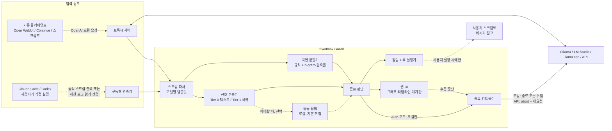

# Overthink Guard 기획 문서 v0.4

> 추론 모델이 생각하는 과정을 보이게 하고, 충분히 생각했으면 끊을 수 있게 해주는 도구.
> 로컬 LLM, API, 구독형 도구(Claude Code, Codex) 어디서 쓰든, Linux·macOS·Windows 어떤 노트북에서든.

| 항목 | 내용 |
| --- | --- |
| 문서 버전 | v0.4 (2026-09-29) |
| 이전 버전 | v0.1: 아이디어 구체화, 레드팀 반박 R1~R12, 판정 기준, 로컬/API 중심 최종 형태 |
| v0.2 변경 | 구독형 도구 지원 설계 추가(알림 기본값, 훅 이벤트, 레시피 원칙), 반박 R13~R16 추가, 결정 기록(ADR) 신설, 구현 가이드·검증 과제·인터페이스 초안 추가, 새 세션에서 단독으로 읽을 수 있도록 배경 보강 |
| v0.3 변경 | 판정 엔진을 "추가 생성 없는 텍스트/확률 신호" 중심으로 전환(D12), 능동 탐침은 선택 옵션으로 격하, 임베딩 모델을 기본 구성에서 제거, 이름 변경(ThinkBrake → Overthinking Safeguard, 사유는 15장) |
| v0.4 변경 | 구현·실측 결과 반영: "현재 상태" 절 신설, 12.4 스파이크에 결과 열, 로드맵에 상태 열, 12.2 구조도를 현재/예정으로 분리, D12 비고(유지 결정과 실측), D13 이름, D14 탐침 트리거, 3.2 번복 단서 수정, 10.1 잔재 제거, 토큰 추정 주의 |
| 이름 | Overthink Guard. 패키지 `overthink-guard`, 모듈 `overthink_guard`, CLI `otg` / `overthink-guard` [확정, D13]. PyPI 0.1.0은 이름 예약용 자리표시자 |

---

## 현재 상태 (2026-09-29 기준, 가장 먼저 읽을 것)

**구현된 것** (코드: `src/overthink_guard/`)
- v0.1 완료. 12.5 완료 조건 5개를 충족했다.
  - Ollama 앞단 OpenAI 호환 프록시
  - 단일 턴 스트리밍 텍스트만 개입하고, 나머지는 바이트 단위로 그대로 통과
  - "지금 답해" (prefill 주입, 같은 응답에 이어 붙임)
  - 실시간 UI
  - Host/Origin 검사
- v0.2 대부분 완료.
  - Shadow 기록: 끝까지 생각한 요청마다 Tier 0과 탐침이 각각 어디서 끊었을지, 그때 답이 같았는지를 통계로만 로컬 JSONL에 남긴다.
  - UI 누적 요약
- v0.3 일부 완료: **Auto 모드(runaway guard)**. 실제 폭주 문제(deepseek-r1, 원래 12,000토큰에서도 답 없음)를 7,202토큰에서 끊고 정답을 냈다. 실측은 이 1건이고, 기록 재생으로는 사전 등록 표본의 폭주 35개 중 13개가 정답을 냈다.
- v0.6 일부 완료(구독형, Claude Code): S4에서 생각 도중의 thinking 내용은 어떤 경로로도 볼 수 없다고 확인했다(R14). 대신 **침묵 시간 알림**(`otg claude-code watch`, 데스크톱 알림과 훅 이벤트 6.2)과 **사후 사용량 리포트**(`otg claude-code report`)를 만들었다. 헤드리스 자동 중단은 레시피 문서만 있다(D7). `docs/spikes/s4-claude-code.md`
- 앞당긴 것:
  - Tier 2 능동 탐침: 선택 기능, 기본 꺼짐(`--probe`). 멈춤 → 탐침 → 재개 방식이다. Tier 0이 기대에 못 미쳐(아래) 비교 데이터를 모으려고 v0.3에서 앞당겼다.
  - YAML 설정 파일(6.1의 일부)
  - README
- 모델 지원: 실측으로 확인된 모델만 개입("지금 답해", 탐침)한다.
  - qwen3: chat prefill 방식
  - deepseek-r1: 템플릿이 prefill을 지원하지 않아 raw 프롬프트 방식(2026-09-30)
  - 그 외 알 수 없는 모델은 관찰만 한다(템플릿의 `prefill_supported` / `raw_prompt`)

**확정된 실측** (근거: `docs/spikes/`)

| 항목 | 결과 |
| --- | --- |
| Tier 0 (R1 공개 trace 986개) | 안전한 설정은 thinking 절감 0.2~2%. 추출기의 사후 상한 자체가 8.1% |
| Tier 1 종료 토큰 마진 (qwen3:1.7b) | 8문제 모두 미발동. Ollama는 `</think>` 위치의 logprob을 주지 않는다 |
| Tier 2 탐침 (qwen3:1.7b, deepseek-r1:1.5b, 6개 표본) | 짧은 thinking까지 줄이는 규칙(3,000토큰 이후 k=4 등)은 처음 보는 표본마다 정답을 1~2개 잃었다(늦은 수정). **사전 등록한 runaway guard(6,000토큰 이후 k=4)** 는 새 문제 70개(정상 종료 51, 폭주 19)에서 정답 손실 0. 다만 끊길 만큼 길었던 정답 실행은 7개뿐이다(규칙 D 검증까지 합쳐 0/15, 95% 상한 약 20%). 폭주 19개를 모두 멈췄고 그중 8개는 정답을 냈다. 전체 thinking 절감은 21~23%(12k 상한 아래, 사전 기준 C2 25% 미달)이고, 정상 종료 실행만 보면 9%다 |
| 지금 답해 | 누른 뒤 첫 답변 토큰까지 0.09초, 캐시 97% 적중 (qwen3). deepseek-r1:1.5b는 chat prefill로는 엉뚱한 출력이 나와서 raw 프롬프트로 구현했고, 0.13초·정답 |
| 탐침 오버헤드 | 전체 시간의 약 4.7% (Apple Silicon GPU), 약 5% (Apple Silicon CPU 전용). x86 CPU는 미측정 |
| 토큰 추정 | 텍스트 추정(4자/토큰)은 Qwen 수학 thinking을 약 1.7배 적게 센다. 프록시는 실제 청크 수를 쓴다 |

**열린 결정**
- D12(Tier 0 기본)는 오너 결정으로 유지 중이다. 탐침이 계속 이기면 재논의한다(9장 D12 비고).
- **로컬 Auto v1 = runaway guard (D15, 2026-09-30 오너 결정).** `otg start --mode auto`로 켜면, thinking이 6,000토큰을 넘은 뒤 탐침 답이 4회 연속 같을 때 자동으로 "지금 답해"와 같은 경로로 끊는다. 기본 모드는 여전히 Shadow다(D8). 짧은 thinking 안의 과잉 검증을 정확도 손실 없이 줄이는 신호는 아직 없다.
  - 2026-09-30 보강(규칙 D): 열린 설계 질문에서는 박스 탐침 답이 의미 없는 상수였다. 그래서 한 줄 답 탐침으로 교차 확인한 답만 유효하게 보고, 유효한 답이 없는 열린 질문은 thinking 10,000토큰 예산으로 끊는다. 사전 등록 검증(새 설계 48, 수학 60)에서 정상 종료 90개를 하나도 끊지 않았고, 폭주 18개를 모두 멈췄다.
- gpt-oss와 더 큰 모델은 아직 확인하지 않았다. raw 형식은 템플릿을 손으로 옮긴 것이라, Ollama가 템플릿을 바꾸면 다시 확인해야 한다.
- 다음 과제: runaway guard의 실제 사용 데이터(Auto 중단 횟수, 사용자 체감), 더 큰 모델에서의 검증, 짧은 thinking용 신호.

**다음 공개(PyPI 0.2.0)**: 성능이 검증된 뒤에 한다(오너 방침).

---

## 0. 이 문서를 읽는 방법 (새 세션용 안내)

이 문서는 기획 대화 전체를 요약한 것이며, **이 문서만 읽고 구현을 시작할 수 있도록** 작성되었다. 구현하는 사람(또는 AI 에이전트)은 다음 순서로 읽기를 권한다.

0. **현재 상태** (바로 위): 무엇이 구현·측정되었고 무엇이 열려 있는가. 아래 장들은 기획 당시의 설계이며, 실측과 다른 부분은 해당 절에 표시했다
1. **1~2장**: 무엇을, 왜 만드는가
2. **9장 결정 기록**: 이미 확정된 설계 결정과 그 이유. 여기 있는 결정을 바꾸려면 먼저 사용자(프로젝트 오너)와 상의할 것
3. **4장 환경별 설계**: 로컬 / API / 구독형이 왜 서로 다르게 동작하는가
4. **12장 구현 가이드**: 기술 스택, 저장소 구조, v0.1 범위, **먼저 검증해야 할 과제(스파이크)**

문서 안의 정보는 세 등급으로 구분된다.

| 표기 | 의미 | 구현 시 태도 |
| --- | --- | --- |
| **[확정]** | 오너와 합의된 결정 | 그대로 따른다 |
| **[가설]** | 합리적 추정이지만 측정 전 | 벤치마크/실험으로 검증 후 조정 |
| **[검증 필요]** | 외부 도구(Ollama, Claude Code, Codex 등)의 동작에 대한 미확인 사항 | **구현 전에 먼저 실제로 확인**. 추측으로 코드를 짜지 말 것 |

### 구현 에이전트를 위한 지침

- 외부 CLI(Claude Code, Codex)와 백엔드(Ollama, LM Studio, llama.cpp)의 옵션명·로그 형식·API 동작은 버전마다 바뀐다. **이 문서에 적힌 외부 동작은 기획 시점의 이해일 뿐**이니, 12.4의 검증 과제로 먼저 확인할 것.
- 확신이 없는 요청 형식(툴 콜, 이미지, 멀티턴 등)은 **가공하지 말고 그대로 통과(pass-through)** 시키는 것이 기본 원칙이다.
- 구독형 도구에 대해 인증 정보를 읽거나, 요청을 대신 보내거나, 프록시하는 코드는 **작성하지 않는다** (9장 D5).

---

## 1. 배경과 문제 정의

### 1.1 관찰된 문제

추론 모델(Claude, GPT/Codex 계열, DeepSeek-R1, Qwen3 등)은 간단한 질문이나 이미 결론에 도달한 상황에서도 수 분간 더 생각한다.

| 문제 | 설명 |
| --- | --- |
| 정확도 | 이미 맞는 답을 낸 뒤 과잉 검증하다가 오답으로 번복하는 경우가 있다. 연구에서는 이를 overthinking이라고 부른다. |
| 비용 | thinking 토큰은 **output 토큰 단가로 과금**된다. 최종 답은 수백 토큰인데 thinking이 수천~수만 토큰인 경우가 흔해서, 비용의 대부분이 thinking에서 나온다. |
| 사용량 한도 | 구독형 도구(Claude Pro/Max로 쓰는 Claude Code, ChatGPT 구독으로 쓰는 Codex)는 토큰당 과금은 없지만 thinking도 사용량 한도를 똑같이 소모한다. |
| 시간과 불투명성 | 사용자는 결론이 이미 나왔는지 모른 채 기다린다. 언제 끊어도 되는지 판단할 근거가 없다. |

### 1.2 과금 관련 확인된 사실 (기획 시점 이해, 공식 문서로 재확인 권장)

- thinking 토큰은 스트리밍 여부와 무관하게 output 토큰으로 과금된다.
- 최신 Claude 모델은 thinking을 **요약해서** 보여주지만, 과금은 요약본이 아니라 실제 생성된 전체 thinking 기준이다.
- OpenAI 계열은 reasoning 원문을 공개하지 않고 요약만 주지만, reasoning 토큰은 output으로 과금된다. 응답의 usage에서 reasoning 토큰 수를 확인할 수 있다.
- OpenRouter의 reasoning 숨김 옵션은 응답에서 가릴 뿐 비용은 그대로다.
- 스트림을 중간에 끊으면 그때까지 생성된 토큰까지만 과금된다(서버의 연결 종료 감지 지연으로 약간의 오차 가능).
- 끊은 뒤 재요청할 때, 이전 thinking 텍스트를 넣으면 그 부분은 input 토큰(대체로 output보다 훨씬 쌈)으로 과금되고 프롬프트 캐싱이 적용되면 더 싸진다.

### 1.3 기존 해결책의 한계

현재 벤더들이 제공하는 것은 **요청 전에 사고량을 정하는** 손잡이뿐이다.

| 제공자 | 손잡이 |
| --- | --- |
| Anthropic (Claude) | effort, thinking budget_tokens, adaptive thinking |
| OpenAI (GPT, Codex) | reasoning_effort (Codex는 설정 파일에서 지정) |
| OpenRouter | 통합 reasoning 설정 (effort, max_tokens, exclude) |
| Google (Gemini) | thinking_budget |
| vLLM | 최근 reasoning budget 기능 추가 논의/도입 (예산 초과 시 종료 토큰 강제 주입) |

**생각 도중에 상황을 보고 끊는 수단**은 연구 코드 수준(Dynasor, DEER, PUMA 등)에만 있고, 사고 흐름 시각화 도구(ReasonGraph, ThinkGraph, ReasonTrace 등)는 **끝난 thinking을 사후 분석**만 한다. 실시간 시각화 + 사람의 개입 + 자동 조기 종료를 노트북 환경에서 하나로 묶은 도구는 기획 시점에 확인되지 않았다.

---

## 2. 목표

### 2.1 한 줄 정의 [확정]

**"어떤 방식으로 추론 모델을 쓰든(로컬/API/구독형), 어떤 노트북에서든(Linux/macOS/Windows), 과잉 사고를 보이게 하고 끊을 수 있게 해주는 도구."**

### 2.2 핵심 원칙 [확정]

모든 환경에서 **같은 기능**을 주는 것이 아니라, **각 환경에서 허용되고 가능한 최대치**를 준다. 끊는 방식의 강도만 환경에 따라 다르다.

| 환경 | 사고 흐름 보기 | 끊기 | 제품이 하는 일 |
| --- | --- | --- | --- |
| 로컬 LLM (Ollama, LM Studio, llama.cpp) | 원문 thinking 전체 | **자동 종료 내장** + 수동 | 사고 종료 토큰 주입으로 즉시 답변 전환 |
| API (Claude, OpenAI, OpenRouter) | 공개되는 thinking/요약 | **수동** (abort + 재요청) | 비용 계기판, effort 추천 |
| 구독형 (Claude Code, Codex) | 화면에 보이는 요약 | **알림 → 사용자가 직접 Esc** | 알림과 훅 이벤트만 제공. 자동화는 사용자가 레시피를 보고 직접 구성 |

### 2.3 OS 지원 [확정]

Linux, macOS, Windows 모두 지원한다. Overthink Guard 자체는 **GPU가 필요 없는** 가벼운 프록시·관측 도구이고, 무거운 추론은 각 백엔드가 담당한다. 로컬 모드의 가속(CUDA, Metal, Vulkan, CPU)은 사용자가 쓰는 백엔드가 처리한다.

이 원칙은 "회사 노트북, 개인 노트북에서도 돌아가야 한다"는 요구에서 나왔다. 회사/개인 노트북의 상당수는 NVIDIA GPU가 없고(Apple Silicon, 내장 그래픽, CPU 전용), 관리자 권한이 없거나 Docker/WSL 설치가 막혀 있는 경우가 많다. 따라서 "CUDA만 있으면"이 아니라 **"아무 노트북에서나, 설치 한 줄로"**가 목표다.

### 2.4 프로젝트 목표 (오너의 의도)

- 최대한 많은 사람이 쓸 수 있도록 경량화·호환성 확보
- 오픈소스로 공개하여 알려지는 것
- 단, 성공 지표는 스타 수가 아니라 실제 지속 사용과 신뢰 (14장)

---

## 3. 핵심 개념

### 3.1 세 가지 요소

| # | 요소 | 내용 |
| --- | --- | --- |
| A | 실시간 사고 그래프 | thinking 스트림을 단계(노드)로 쪼개고 흐름의 국면을 실시간으로 그린다 |
| B | 사람의 개입 | "지금 답해", 또는 그래프에서 특정 잠정 결론 노드를 골라 "여기까지의 생각으로 답해" |
| C | 자동 조기 종료 | 흘러나오는 thinking에서 잠정 답이 수렴하고 추론이 반복만 하고 있으면 자동으로 끊는다 (로컬 전용). 판단은 추가 생성 없는 가벼운 신호로 한다 (3.4) |

### 3.2 노드 타입

| 타입 | 의미 | 탐지 단서 (규칙 기반 초기 버전, 영어 thinking 기준) |
| --- | --- | --- |
| 문제 이해 | 질문 재진술, 조건 정리 | 초반부, "the question asks", "we need to" |
| 가설 | 접근 방법 제시 | "maybe", "let's try", "one approach" |
| 계산 | 구체적 연산/도출 | 수식, 숫자 밀도 |
| 검증 | 결과 재확인 | "let me verify", "check", "double-check", "wait", "hmm", "actually" |
| 잠정 결론 | 답 후보 등장 | "so the answer is", "the answer is", 박스 표기 (v0.4: "therefore x = 3" 형태는 중간 대입을 잡아 제거) |
| 번복 | 이전 결론 수정 | 명시적 부정("that's wrong", "I made a mistake", "that can't be right") 또는 **잠정 답이 실제로 바뀜**. v0.4: "wait/actually/but"은 R1 계열에서 번복보다 과잉 검증의 시작어로 훨씬 흔해, 번복으로 보면 cooldown이 계속 걸린다. 그래서 검증으로 분류한다 |
| 반복 | 새 정보 없이 이미 나온 내용 재확인 | 이전 노드와의 유사도가 높음 |

그래프에서 가장 중요한 시각 신호는 두 가지다.

- **잠정 결론 뒤에 반복 노드만 쌓이는 구간** → overthinking 가능성이 높다. 끊어도 안전할 확률이 높다.
- **잠정 결론 뒤에 번복 노드가 등장** → 모델이 실제 오류를 발견했을 수도, 과잉 의심일 수도 있다. 사람이 판단할 지점이며, 자동 종료는 이 직후에 금지된다.

그래프의 목적은 정밀한 논리 구조 복원이 아니라 **흐름의 국면 표시**(탐색 중 / 결론 도달 / 반복 중 / 번복)다 (9장 D4).

### 3.3 조기 종료의 원리 (로컬)

로컬 모델은 생성 루프를 직접 제어할 수 있으므로, 원하는 시점에 생성을 멈추고 지금까지의 thinking 뒤에 모델별 사고 종료 표기(예: `</think>`)와 짧은 전환 문구를 붙여 이어서 생성시키면 모델이 바로 답변으로 넘어간다. 이는 s1 논문의 budget forcing, vLLM의 reasoning budget 기능과 같은 원리다.

```python
# 개념 예시
prompt = question_prompt + "<think>\n" + partial_thinking + "\n</think>\n\n"
answer = backend.continue_raw(prompt, max_tokens=512)
```

### 3.4 판정 신호 사다리 [확정: v0.3에서 변경]

**원칙: "끊어도 되나"를 판단하는 데 무거운 연산을 쓰지 않는다.** 판정은 기본적으로 이미 흘러나오는 텍스트(와 가능하면 토큰 확률)만 보고, 추론 모델에게 추가 생성을 시키지 않는다 (9장 D12).

| 단계 | 신호 | 비용 | 적용 환경 |
| --- | --- | --- | --- |
| **Tier 0 (기본)** 텍스트 신호 | ① **잠정 답 반복**: thinking 안에 모델이 스스로 쓴 "so the answer is X", "therefore x = 3", 박스 표기 등을 정규식으로 추출해, 같은 잠정 답이 몇 번 반복되는지 센다 (수동적 탐침) ② **내용 반복**: 최근 구간과 이전 구간의 n-gram 겹침 비율, 압축률 변화(같은 말을 되풀이하면 압축이 잘 됨) ③ **국면 규칙**: 번복/검증 표현 등장 여부 | 문자열 처리. 사실상 0 | 로컬, API, 구독형 **모두** |
| **Tier 1 (가능하면)** 확률 신호 | ① 토큰 엔트로피: 확신을 갖고 반복할 때 낮게 깔리는 패턴 ② **종료 토큰 확률 마진**: 문장 경계에서 "다음 최상위 토큰"과 사고 종료 토큰의 log-probability 차이가 작아지면 모델 스스로 끝낼 준비가 된 것 (ThinkBrake 논문 방식, 17.1) | 백엔드가 스트리밍 중 logprob/top-k를 줄 때만. 추가 생성 없음 | 로컬 (백엔드 지원 시). S8 결과: Ollama는 스트리밍 logprob을 주지만, qwen3:1.7b에서 신호가 한 번도 발동하지 않았다 |
| **Tier 2 (선택, 기본 꺼짐)** 능동 탐침 | 추론 모델에게 답을 짧게 뽑게 하는 방식 (Dynasor, DEER). 구현: 멈춤 → `\boxed{`까지 prefill해 탐침 → 재개 | 추가 생성 필요. 실측: 캐시 정렬 덕분에 탐침 1회 약 0.2초, 전체 오버헤드 약 4.7% (Apple Silicon) | 로컬, 사용자가 켰을 때만(`--probe`). 트리거는 고정 간격(D14) |

이 구조의 장점:
- **세 환경이 하나의 판정 엔진을 공유**한다. 구독형은 요약 텍스트밖에 없어 탐침이 불가능하고, API는 탐침이 곧 비용이다. Tier 0은 어디서나 동작한다.
- 노트북 성능과 무관하게 판정이 가볍다. 별도 임베딩 모델도 필요 없다.

감수하는 것:
- 수동 신호는 능동 탐침보다 덜 정확할 수 있다. 특히 모델이 잠정 답을 thinking에 명시적으로 쓰지 않는 유형(서술형, 코드 설계 등)에서 약하다.
- 따라서 v0.4 벤치마크에서 **Tier 0만 / Tier 0+1 / Tier 0+1+2**의 정확도·절감률 차이를 실측하고, 차이가 C1 허용선(1%p) 안이면 Tier 2는 선택 기능으로 확정한다. 초과하면 Tier 2를 "애매할 때만 자동 호출"로 조정한다.

**v0.4 실측 요약** (자세한 내용은 `docs/spikes/`와 "현재 상태" 절)
- 위의 "감수하는 것"이 예상보다 크게 나타났다. 모델은 답에 thinking 중간쯤에서 도달하지만, 추출 가능한 형태("the answer is", `\boxed{}`)는 대부분 마지막 "Final Answer" 부분에서만 쓴다.
  - 그래서 Tier 0의 사후 상한은 8.1%다(R1 trace 986개).
  - 추출을 느슨하게 하면 중간 계산값을 답으로 착각해 위험이 급증한다.
- "Tier 0이 애매할 때만 탐침"은 성립하기 어렵다. Tier 0이 잠정 답을 거의 못 잡기 때문에, 이 조건으로는 탐침을 거의 하지 않는다. 그래서 탐침 트리거는 고정 간격으로 정했다(D14).

---

## 4. 환경별 동작 설계

### 4.1 로컬 모드

- 대상: Ollama, LM Studio, llama.cpp server (선택: vLLM은 커뮤니티 지원)
- 구조: OpenAI 호환 프록시. 사용자는 기존 클라이언트(Open WebUI, Continue, 직접 짠 스크립트 등)의 base_url만 Overthink Guard로 바꾼다.
- 기능: A, B, C 전부
- 기본 모드: **Shadow로 시작 → 충분히 쓰면 Auto 전환 제안** (5.2)

### 4.2 API 모드

- 대상: Anthropic API, OpenAI API, OpenRouter
- 구조: 로컬 모드와 같은 프록시. 사용자가 자기 API 키로 쓴다.
- 기능: A(공개되는 thinking/요약 한정), B(스트림 abort 후 재요청), 비용 계기판, effort 추천
- **자동 종료는 제공하지 않는다** (9장 D6)
- 수동 중단 흐름: 스트림 abort → 받은 thinking 텍스트를 일반 메시지로 넣어 "지금까지의 추론을 바탕으로 바로 답하라"를 thinking 없이(또는 최소 effort로) 재요청
- 알려진 제약:
  - Claude thinking 블록에는 서명이 있어서, 잘린 블록을 assistant 턴의 thinking으로 되돌려 넣을 수 없다. 텍스트로 옮겨야 한다.
  - Claude는 요약된 thinking을, OpenAI는 요약만 제공하므로 그래프 품질이 로컬보다 낮다.
  - 재요청은 원래 흐름보다 답 품질이 낮을 수 있다. UI에 명시한다.

### 4.3 구독형 모드 (Claude Code, Codex) — v0.2 신설

#### 왜 프록시를 쓰지 않는가

기획 과정에서 조사한 내용(2차 출처 포함, 출시 전 공식 약관 재확인 필수):

- Anthropic은 2026년 초 Free/Pro/Max 구독 OAuth 토큰을 서드파티 도구에서 사용하는 것을 금지한다고 약관·문서로 명확히 했다. 보도에 따르면 2026-01-09 서버 측 차단 시작, 2026-02-19 전후 문서/약관 명확화, 2026-04-04 서드파티 도구에 대한 구독 적용 중단 집행 순서로 진행되었다. 구독 자격 증명으로 최종 사용자 요청을 프록시하는 것도 허용되지 않는다.
- 기술적으로도 Claude Code는 OAuth 모드에서 ANTHROPIC_BASE_URL만으로는 프록시로 가지 않고 API 키 모드가 필요하다는 보고가 있으며, base URL이 공식 주소가 아니면 구독 기능을 비활성화한다는 이슈도 있다.
- 공식 CLI를 `claude -p`처럼 하위 프로세스로 실행하는 것은 토큰을 추출하지 않는 공식 지원 사용 패턴으로 설명된다.
- OpenAI는 Codex에 대해 구독을 서드파티에서 쓰는 방식에 상대적으로 관대하다는 언급이 있으나 공식 확인은 하지 않았다. 게다가 Codex reasoning은 암호화된 형태로 오가고 사람이 볼 수 있는 것은 요약뿐이다.
- 두 도구 모두 에이전트 루프라서 요청 대부분이 툴 콜이고, Overthink Guard v1.0은 툴 콜을 pass-through하므로 프록시로 붙어도 개입할 요청이 거의 없다.

따라서 구독형 도구에 대해서는 **프록시가 아니라 관측**으로 접근한다.

#### 동작 방식 [확정]

1. **관측**: 사용자에게 이미 보여지는 thinking 요약을 읽기 전용으로 추적한다. 인증을 건드리지 않고, 요청을 대신 보내지 않는다.
   - 1순위: 공식 스트리밍 출력 경로(비대화형 모드의 JSON 스트림 출력, IDE 연동용 프로토콜 등) [검증 필요]
   - 2순위: 로컬 세션 기록 파일 tail (Claude Code: `~/.claude/projects/` 아래 세션 JSONL, Codex: `~/.codex/sessions/` 아래 rollout JSONL) [검증 필요: 생각 도중에 실시간 기록되는지]
2. **판단**: 요약 흐름에서 잠정 결론 이후 반복이 이어지는지 등을 분석한다.
3. **알림 (기본값)**: "끊어도 될 것 같음"을 데스크톱 알림/소리/UI 배지로 알린다. **사용자가 직접 CLI에서 Esc를 눌러 중단**하고, 같은 세션에서 "지금까지 판단으로 진행해" 같은 후속 지시를 보낸다. thinking 서명 처리 등은 CLI가 알아서 한다.
4. **훅 이벤트**: 알림과 동시에, 사용자가 설정해 둔 명령이 있으면 이벤트 JSON을 넘겨 실행한다. 기본값은 비어 있어서 아무 일도 일어나지 않는다.
5. **레시피 문서**: 훅 이벤트를 받아 공식 프로그래밍 인터페이스로 자동 중단하는 방법은 **제품 코드로 제공하지 않고**, `docs/recipes/`에 설정 방법과 예시 스크립트로만 안내한다 (9장 D7).
6. **분석과 조언**: reasoning이 구독 한도를 얼마나 소모하는지 보여주고, 작업 유형별로 effort를 낮추라고 제안한다. 구독 사용자에게 가장 실질적인 가치다.

#### 중단 방식별 위험도 정리

| 방식 | 약관 위험 | Overthink Guard의 역할 |
| --- | --- | --- |
| 요약을 보여주고 "끊어도 될 듯" 알림, 사용자가 직접 Esc | 매우 낮음 (사람이 공식 기능을 쓰는 것과 동일) | **기본값으로 제공** |
| 공식 프로그래밍 인터페이스로 자동 중단 (사용자 스크립트가 띄운 `claude -p` 프로세스 종료, Codex 공식 연동 프로토콜의 중단 요청 등) | 낮음. 단 구독 한도는 "평범한 개인 사용" 전제 | **직접 제공하지 않음.** 훅 이벤트 + 레시피 문서만 제공 |
| 대화형 터미널에 키 입력을 흉내 내서 강제 중단 | 약관보다 기술적 위험(불안정, 업데이트마다 깨짐) | **제공하지 않고 레시피에서도 안내하지 않음** |
| 구독 OAuth 토큰 사용, 구독 트래픽 프록시 | 약관 위반 | **절대 하지 않음** |

#### 알려진 한계

- 요약은 원래 사고보다 늦게, 뭉뚱그려서 나온다. 요약에 결론이 보일 때 모델은 이미 한참 더 생각했을 수 있어서, 로컬만큼 정확한 타이밍은 불가능하다.
- 이미 생성된 thinking은 한도를 소모한 뒤라서, 절약되는 것은 중단 이후의 남은 사고량뿐이다.
- 공식 자동화 인터페이스는 비대화형(헤드리스) 실행용이다. **평소처럼 터미널에서 대화형으로 쓰는 세션은 자동 중단 대상이 아니며**, 거기서는 알림 + Esc가 유일한 방식이다.
- 실시간 요약을 얻을 공식 경로가 없다고 확인되면, 구독형 모드는 **사후 분석 + effort 추천**으로 축소한다 (R14 판정).

---

## 5. 최종 형태

### 5.1 사용 모드

| 모드 | 무엇을 하나 | 적용 환경 |
| --- | --- | --- |
| Shadow (그림자) | 끝까지 생각하게 두고 "여기서 끊었다면 N토큰 절약, 답은 같았음/달랐음"을 기록 | 로컬, API |
| Auto (자동) | 수렴 판정 시 자동으로 끊고 답변 전환. UI 없이 동작 | **로컬 전용** |
| Watch (관찰) | 실시간 그래프 + 수동 중단 + "지금 끊어도 될 것 같음" 제안 | 로컬, API |
| Notify (알림) | 요약 관측 + 알림 + 훅 이벤트. 중단은 사용자가 직접 | **구독형 전용** |

환경별 기본값:

| 환경 | 기본 모드 |
| --- | --- |
| 로컬 | Shadow → 일정 횟수 이상 사용 후 Auto 전환 제안 |
| API | Watch (Shadow 통계는 effort 추천에 사용) |
| 구독형 | Notify (훅은 비어 있음) |

### 5.2 지원 범위 (v1.0 목표)

| 구분 | 포함 | 제외 (pass-through 또는 추후) |
| --- | --- | --- |
| 로컬 백엔드 | Ollama, LM Studio, llama.cpp server | vLLM(커뮤니티), 기타 |
| API | Anthropic, OpenAI, OpenRouter (관측/수동/비용/effort 추천) | API 자동 종료 |
| 구독형 | Claude Code, Codex (관측/알림/훅/분석) | 인증 사용, 프록시, 키 입력 주입 |
| 모델 계열 | DeepSeek-R1 distill, Qwen3 계열, gpt-oss, `<think>` 표준 태그 모델 | 비표준 포맷(템플릿 기여 시 추가) |
| 요청 종류 | 단일 턴 텍스트 추론 | 툴 콜, 이미지, 멀티턴 thinking 재전달 |
| OS | macOS, Windows, Linux | — |

### 5.3 아키텍처



구독형 경로에서 Overthink Guard가 도구로 보내는 화살표는 **없다**. 도구에 대한 행동은 사용자(Esc) 또는 사용자 스크립트만 한다.

### 5.4 자동 종료 판정 로직 (로컬 Auto 모드) [가설: 수치는 벤치마크로 조정]

아래 조건을 **모두** 만족할 때만 발동한다. 신호는 3.4의 사다리를 따른다.

1. **답 수렴**: thinking 안에서 추출한 잠정 답이 최근 k번 연속 동일 (기본 k=3, Tier 0). Tier 1 종료 토큰 마진을 쓸 수 있으면 보조 증거로 사용. Tier 2 탐침은 사용자가 켰을 때 최소 사고량(기본 6,000토큰) 이후 고정 간격으로 실행하고, 탐침 답이 k번 연속 같으면 수렴으로 본다(기본 k=4, D14).
2. **추론 반복**: 마지막 잠정 결론 이후 구간의 반복 정도가 임계값 이상 (새 정보 없음, Tier 0). 구현은 압축 기반 신규성(novelty)만 쓴다. 실측상 거의 그대로 반복한 문장만 잡고, 말을 바꾼 재검증은 새 내용과 구분하지 못한다.
3. **번복 금지 구간 아님**: 최근 번복 이후 일정 토큰이 지났음. 번복의 정의는 3.2 표를 따른다.
4. **최소 사고량 충족**: 처음 몇백 토큰 이내에는 끊지 않음.

토큰 수 주의: 임계값은 토큰 단위다. 프록시는 백엔드의 실제 토큰 수(Ollama는 청크당 1토큰)를 쓴다. 반면 오프라인 `otg analyze`와 `bench/r1_replay.py`는 텍스트 추정을 쓰며, 이 추정은 Qwen 수학 thinking을 약 1.7배 적게 센다. 오프라인에서 튜닝한 절대값을 프록시에 그대로 옮기지 말 것.

잠정 답이 추출되지 않는 요청(서술형 등)에서는 1번이 성립하지 않는다. 그래서 Auto는 이런 요청을 수렴으로 끊지 않고, thinking 예산(기본 10,000토큰)을 넘을 때만 끊는다(D15, `DEFAULT_OPEN_BUDGET_TOKENS`). 틀리게 끊는 것보다 안 끊는 쪽이 안전하다(C1).

구독형 Notify 모드와 API Watch 모드의 "끊어도 될 듯" 제안도 **같은 판정기**(Tier 0)를 쓴다. 차이는 판정 결과로 무엇을 하느냐뿐이다(로컬: 자동 종료, API: 제안 표시, 구독형: 알림 + 훅).

### 5.5 구성 요소

| 구성 요소 | 역할 | 비고 |
| --- | --- | --- |
| 프록시 | OpenAI 호환 엔드포인트, 라우팅, pass-through | 127.0.0.1 전용 |
| 백엔드 어댑터 | Ollama/LM Studio/llama.cpp/API별 차이 흡수 | 12.3 인터페이스 |
| 구독형 관측기 | Claude Code/Codex의 요약 스트림 또는 로그 읽기 | 읽기 전용, 인증 접근 없음 |
| 템플릿 레지스트리 | 모델별 thinking 시작/종료 표기, 주입 문구 | YAML, 커뮤니티 기여 |
| 스트림 파서 | thinking/answer 분리, 요약 조각 정규화 | |
| 국면 분할기 | 노드 분할 + 반복 판정 | 규칙 기반 + n-gram/압축률. 임베딩 모델 없음 (D12) |
| 신호 추출기 | 잠정 답 추출(Tier 0), logprob 신호(Tier 1) | 추가 생성 없음 |
| 탐침기 (선택) | 능동 탐침(Tier 2) | 로컬 전용, **기본 꺼짐**. 켜면 보정 단계에서 오버헤드 측정 후 간격 결정 |
| 종료 판단 | 5.4 조건 평가 | |
| 종료 컨트롤러 | 자동/수동 종료 실행 | 로컬: 토큰 주입 / API: abort + 재요청 / 구독형: 없음 |
| 알림·훅 실행기 | 데스크톱 알림, 소리, 훅 명령 실행 | 훅은 기본 비활성 |
| 웹 UI | 그래프, 탐침 답 타임라인, 절약/사용량 계기판 | 선택 사항. 안 열어도 동작 |
| 기록 저장소 | Shadow 결과, 절약 통계 | 로컬 파일. 기본은 통계만(원문 저장 안 함) |

### 5.6 배포

- 1단계: `uv tool install` / `pipx install` 한 줄 설치 (Python 필요)
- 2단계: Python 없는 환경을 위한 단일 실행 파일 (Windows/macOS/Linux)
- 3단계: 데스크톱 트레이 앱 (선택)

---

## 6. 인터페이스 초안

### 6.1 설정 파일 (가안)

v0.4 구현 상태: `src/overthink_guard/config.py`가 아래 키 중 일부만 받는다.
- 받는 키: `server.host/port`, `local.backend_url`, `local.mode`(shadow | auto), `local.auto_stop.*`, `local.signals.active_probe/probe_interval_tokens/probe_min_tokens/probe_converge_k`, `privacy.stats_file`
- 나머지 키는 예정이며, 지금은 **모르는 키로 거부**된다(오타가 조용히 무시되지 않게).
- `local.backend` 대신 `local.backend_url`을 쓰는데, 지금은 백엔드가 Ollama뿐이기 때문이다.

```yaml
# ~/.config/overthink-guard/config.yaml (Windows는 %APPDATA%\overthink-guard\config.yaml)
server:
  host: 127.0.0.1        # 외부 바인딩 금지가 기본
  port: 8484

local:
  backend: auto          # auto | ollama | lmstudio | llamacpp
  mode: shadow           # shadow | auto | watch
  auto_stop:
    converge_k: 3                 # 같은 잠정 답이 연속 몇 번 나와야 수렴으로 볼지
    min_thinking_tokens: 300
    revision_cooldown_tokens: 200
    repetition_threshold: auto    # n-gram 겹침/압축률 임계값 (벤치마크로 기본값 확정)
  signals:
    logprob: auto                 # 백엔드가 지원하면 Tier 1 사용
    active_probe: false           # Tier 2 능동 탐침. 기본 꺼짐
    probe_interval_tokens: auto   # active_probe가 켜졌을 때만 의미 있음

api:
  mode: watch            # watch | shadow (auto 없음)

subscription:
  enabled: false
  tools: [claude_code, codex]
  source: auto           # auto | stream | log

notify:
  desktop: true
  sound: true

hooks:
  on_stop_suggested: ""  # 기본 비어 있음. 사용자가 직접 명령을 넣었을 때만 실행
  timeout_s: 10

privacy:
  store_raw_text: false  # 원문 thinking 저장 안 함
  telemetry: false
```

### 6.2 훅 이벤트 스키마 v1 (가안)

훅 명령은 표준 입력으로 아래 JSON을 받는다. **이 스키마는 프로젝트가 안정성을 보장하는 계약**이며, 바꿀 때는 `schema_version`을 올린다. 레시피는 이 스키마에만 의존해야 한다.

```json
{
  "schema_version": 1,
  "event": "stop_suggested",
  "timestamp": "2026-09-29T21:04:11+09:00",
  "source": {
    "kind": "subscription",
    "tool": "claude_code",
    "session_id": "…",
    "run_mode": "headless"
  },
  "signal": {
    "reasons": ["reasoning_repetition", "tentative_conclusion_reached"],
    "confidence": 0.82,
    "since_last_revision_s": 41
  },
  "stats": {
    "thinking_elapsed_s": 96,
    "summary_chunks": 14
  }
}
```

- `source.kind`: `local` | `api` | `subscription`
- `source.run_mode`: `interactive` | `headless` | `unknown`. 레시피는 `headless`일 때만 자동 중단하도록 안내한다.
- 원문 발췌(잠정 답 등)는 기본적으로 포함하지 않는다. 필요 시 설정으로 켠다.

### 6.3 모델 템플릿 (가안)

```yaml
# templates/qwen3.yaml
id: qwen3
match: ["qwen3*", "qwq*"]
thinking:
  start: "<think>"
  end: "</think>"
stop_injection:
  text: "\n\nI have enough to answer now.\n</think>\n\n"
tentative_answer_patterns:     # Tier 0 잠정 답 추출용 (예시, S9로 검증)
  - '(?i)(?:so|thus|therefore),? the (?:final )?answer is[:\s]+(.+?)[.\n]'
  - '\\boxed\{(.+?)\}'
probe:                         # Tier 2 (선택)
  suffix: "\n</think>\n\nFinal answer (short):"
  max_tokens: 32
```

---

## 7. 레드팀 반박

> "이 프로젝트를 반대하는 리뷰어" 관점으로 작성했다. 목적은 무엇을 버리고 무엇을 지킬지 정하는 것이다. R1~R12는 v0.1, R13~R16은 v0.2에서 추가.
> 심각도: 치명(방향 변경) / 높음(설계 변경) / 중간(대응 필요) / 낮음(인지)

| # | 반박 | 심각도 |
| --- | --- | --- |
| R1 | **벤더들이 이미 해결 중이다.** adaptive thinking, effort 등으로 모델 스스로 사고량을 조절하는 방향. 1~2년 뒤 존재 이유가 약해질 수 있다. | 높음 |
| R2 | **사람은 thinking을 보지 않는다.** 대부분은 답만 원한다. 에이전트/배치에는 보는 사람이 없다. "사람이 보고 끊는다"가 핵심이면 니치 도구로 끝난다. | 치명 |
| R3 | **조기 종료는 정확도를 떨어뜨린다.** 답 확신도·일관성 신호는 "답 준비"일 뿐 "추론 종료"가 아니다(PUMA 지적). 자기수정 전에 끊으면 오답. 한 번이라도 "이 도구 때문에 틀렸다"면 사용자는 끈다. | 높음 |
| R4 | **탐침 오버헤드가 절감분을 잡아먹는다.** prefix 캐시가 약한 백엔드나 CPU 노트북에서는 탐침 비용 > 절약분일 수 있다. | 높음 |
| R5 | **규칙 기반 그래프는 장식이다.** 단어 매칭 그래프는 부정확하고 잘못 끊게 만들 수 있다. 정밀 분류 모델은 경량화와 충돌. | 중간 |
| R6 | **API 모드는 핵심 가치를 못 전한다.** 요약/비공개 thinking, 재요청 품질 저하, 추가 비용·지연. | 높음 |
| R7 | **노트북 로컬 모델은 이득이 작다.** 작은 모델은 성능이 낮아 중요한 추론에 안 쓰일 수 있다. | 중간 |
| R8 | **모델 포맷 파편화.** `<think>`, gpt-oss 채널, Qwen3 on/off, 백엔드별 필드 차이. 1인 유지보수 불가. | 중간 |
| R9 | **프록시 엣지 케이스.** 툴 콜, 멀티턴, 스트리밍 포맷, 동시성, 타임아웃. 하나라도 깨면 신뢰 상실. | 중간 |
| R10 | **차별성이 "조합"뿐이다.** Ollama/Open WebUI/LM Studio가 비슷한 기능을 넣으면 끝. | 중간 |
| R11 | **회사 노트북 보안 정책과 충돌.** 로컬 포트, 로그 저장, API 키 취급. | 높음 |
| R12 | **데모 효과로 끝난다.** 스타는 모여도 매일 쓰는 도구가 안 되면 잊힌다. | 중간 |
| R13 | **구독형 도구는 약관상 건드리면 안 된다.** 구독 OAuth의 서드파티 사용과 프록시가 금지됨. "구독제도 지원"이라고 하면 약관 위반 도구로 오해받는다. | 높음 |
| R14 | **구독형은 실시간성이 없을 수 있다.** 세션 로그가 thinking 블록이 끝난 뒤에야 기록되면 중단 시점을 놓친 뒤에 보게 된다. 요약 자체도 늦고 뭉뚱그려진다. | 높음 |
| R15 | **레시피로 자동화를 안내하면 책임과 유지보수가 따라온다.** 코드 대신 문서를 준다고 책임이 사라지지 않고, CLI 업데이트마다 레시피가 깨져 이슈가 쌓인다. 자동 후속 지시가 루프에 빠질 위험도 있다. | 중간 |
| R16 | **세 환경 × 세 OS는 1인 프로젝트에 과한 범위다.** 처음부터 전부 하려다 어느 것도 완성도 있게 못 낸다. | 높음 |

---

## 8. 판정 기준과 반박별 판정

### 8.1 판정 기준 [가설: 수치는 v0.4 벤치마크로 검증 후 조정]

| 기준 | 내용 | 초기 허용선 |
| --- | --- | --- |
| C1 정확도 | Auto 기본 설정에서 끝까지 생각했을 때 대비 정확도 하락 | 쉬움/중간 난이도 벤치마크에서 1%p 이하. 넘으면 기본값을 보수적으로 |
| C1a 정답 손실 (D16) | 끊길 만큼 길었던 **정답 실행** 가운데 끊어서 틀린 실행(FP)의 수. 얻은 정답으로 상쇄하지 않는다 | 사전 등록 표본에서 0이고, 적격 실행이 쌓일수록 95% 상한(대략 3/적격 수)을 함께 보고한다. 목표는 적격 100개 이상에서 FP 1 이하 |
| C2 효율 | Auto로 줄어드는 평균 thinking 토큰 | 쉬움/중간에서 25% 이상. 미달이면 Auto 가치 재검토 |
| C3 오버헤드 | 탐침에 쓰인 추가 시간 | 총 생성 시간의 10% 이하. 넘으면 탐침 축소/비활성 |
| C4 설치 | 관리자 권한 없이 첫 요청까지 | 모델 다운로드 제외 5분 이내, Docker/WSL 불필요 |
| C5 리소스 | 프록시 + UI 자체 자원 | 메모리 300MB 이하, 대기 중 CPU 거의 0 |
| C6 프라이버시 | 네트워크/로그/텔레메트리 기본값 | 127.0.0.1 바인딩, 원문 로그 꺼짐, 텔레메트리 없음(또는 명시적 opt-in) |
| C7 무해성 | 켜도 기존 동작이 깨지지 않음 | 모르는 요청은 가공 없이 pass-through |
| C8 유지보수 | 1인 + 소수 기여자가 감당 가능한가 | v1.0 공식 지원: 로컬 백엔드 3종, 모델 계열 4종. 나머지는 커뮤니티 |
| C9 약관 준수 | 외부 서비스 약관과 충돌하지 않는가 | 구독형 인증 접근·프록시·요청 대행 0건. 제품이 직접 수행하는 자동 행동은 로컬/API에 한정 |

### 8.2 반박별 판정

| 반박 | 판정 | 대응 | 기준 |
| --- | --- | --- | --- |
| R1 | 부분 수용 | 사전 effort 조절과 경쟁하지 않는 **보완재**로 포지셔닝. 모델이 사고량을 줄여도 "왜 이만큼 생각했는지 보이는 것"과 "개입할 수 있는 것"은 남는다. API/구독형에 effort 추천 기능. 장기 가치의 무게중심은 로컬. | — |
| R2 | **수용 (방향 수정)** | 핵심 가치를 "사람이 보고 끊는다"에서 **"기본은 자동(로컬), 보고 싶을 때만 본다"**로 변경. UI 없이도 동작. | C1, C7 |
| R3 | 수용 | 답 수렴 + 추론 반복 **둘 다** 요구, 번복 직후 종료 금지, 최소 사고량. **Shadow 모드**로 신뢰를 먼저 쌓고 Auto 전환. | C1 |
| R4 | **수용 (v0.3에서 근본 해결)** | 판정의 기본을 추가 생성 없는 Tier 0/1 신호로 전환(D12). 능동 탐침은 기본 꺼짐이므로 기본 구성의 탐침 오버헤드는 0. 사용자가 탐침을 켜면 보정 단계에서 오버헤드를 측정해 기준 초과 시 간격 확대. | C3 |
| R5 | 부분 수용 | 그래프 목적을 **국면 표시**로 낮춤. 반복 판정은 임베딩 없이 n-gram 겹침·압축률로(D12). 정밀 분류는 선택 옵션. | C5 |
| R6 | 수용 (범위 축소) | API 모드는 관측 + 수동 + 비용 계기판 + effort 추천. 자동 종료 없음. "실험적" 표시, 재요청 품질 저하 명시. | C7 |
| R7 | 기각 (측정 조건부) | 소형 distill 모델일수록 overthinking이 심하다는 관측이 있다(Dynasor 팀 사례: 340토큰에 정답 후 1000토큰 이상 추가 검증). v0.4에서 실측 공개. C2 미달 시 재검토. | C2 |
| R8 | 수용 | 모델별 템플릿을 **선언형 YAML**로 분리, 커뮤니티 기여. 공식 지원 범위를 좁게 명시. 모르는 포맷은 통과. | C7, C8 |
| R9 | 수용 | v1.0은 **단일 턴 텍스트 추론만 개입**. 툴 콜·이미지·멀티턴 thinking 재전달은 전부 pass-through. 개입 여부를 응답 헤더와 UI에 표시. | C7 |
| R10 | 부분 수용 | 차별성: 노트북 우선, Shadow 신뢰 구축, 공개 벤치마크, 연구 기법 플러그인화, 세 환경 통합 관측. 대형 프로젝트에 **엔진/플러그인으로 흡수되는 것도 성공**으로 본다. | — |
| R11 | 수용 | 로컬 전용 바인딩, 원문 로그 꺼짐, 텔레메트리 없음, API 키는 환경변수/OS 키체인에서만 읽고 저장 안 함. "데이터가 어디로 가는지" 한 장짜리 보안 문서. | C6 |
| R12 | 수용 | 성공 지표를 지속 사용 신호로(14장). 매일 쓰게 하는 장치: "오늘 절약한 토큰/시간/한도" 요약, 헤드리스 Auto. | — |
| R13 | **수용 (설계 원칙화)** | 구독형은 **프록시·인증 접근·요청 대행을 하지 않고 관측만** 한다. 문서와 README에 "Overthink Guard는 구독 자격 증명에 접근하지 않습니다"를 명시. 출시 전 최신 약관 재확인. | C9 |
| R14 | 수용 (검증 조건부) | 12.4 스파이크 S4, S5로 **생각 도중 요약이 흘러나오는 공식 경로**가 있는지 먼저 확인. 공식 스트림 경로 우선, 로그 tail은 보조. 실시간 경로가 없으면 구독형 모드는 **사후 분석 + effort 추천**으로 축소. 요약 지연 한계는 문서에 명시. | C9 |
| R15 | 수용 | **"신호는 우리가, 행동은 사용자가"** 원칙. 제품은 안정적인 훅 이벤트 스키마만 보장하고 자동 중단 코드는 넣지 않는다. 레시피 문서에는 ① 적용 범위(헤드리스 세션만, 대화형 제외) ② 검증한 CLI 버전과 날짜 ③ 약관 준수는 사용자 책임, 구독 한도는 개인 사용 전제라는 고지 ④ 자동 후속 지시 횟수 제한(루프 방지)을 반드시 포함. 레시피를 "우회로"처럼 표현하지 않고 "공식 인터페이스로 직접 구성하는 선택 기능"으로 소개. | C8, C9 |
| R16 | 수용 (단계화) | 목표 범위는 유지하되 **출시 순서를 단계화**: 로컬(Ollama) → Shadow/Auto → 벤치마크 → API → 구독형 관측(13장 로드맵). 순수 파이썬 로직은 처음부터 3개 OS CI에서 테스트해 OS 호환성 부채를 미리 막는다. | C8 |

---

## 9. 결정 기록 (ADR 요약)

각 결정은 "무엇을, 왜, 버린 대안"으로 기록한다. **바꾸려면 오너와 먼저 상의할 것.**

| ID | 결정 [확정] | 이유 | 버린 대안 |
| --- | --- | --- | --- |
| D1 | 지원 환경은 로컬·API·구독형 세 가지, 각 환경에서 가능한 최대치를 제공 | 사용자는 여러 방식으로 추론 모델을 쓴다. 한 환경만 지원하면 도달 범위가 좁다. 단, 환경별 제약(약관, thinking 공개 수준)이 달라 같은 기능은 불가능 | 로컬 전용 / 모든 환경 동일 기능 |
| D2 | Linux·macOS·Windows 모두 지원, 제품 자체는 GPU 불필요 | 회사/개인 노트북의 다수가 NVIDIA GPU가 없고 관리자 권한이 제한됨 | CUDA 전제, vLLM 전제(Linux/WSL 필요) |
| D3 | 로컬 백엔드는 llama.cpp 계열 우선(Ollama, LM Studio, llama.cpp server), vLLM은 커뮤니티 | llama.cpp는 CUDA/Metal/Vulkan/CPU 지원, GGUF 양자화로 저사양 가능, Windows 네이티브. 많은 사용자가 이미 Ollama/LM Studio를 설치해 둠. Dynasor는 vLLM 기반이라 진입장벽이 높음 | Dynasor 그대로 사용, vLLM 필수 |
| D4 | 그래프는 정밀 논리 구조가 아닌 국면 표시, 규칙 기반 + n-gram/압축률 | 경량화(C5)와 정확도 사이 절충 | 소형 LLM으로 모든 청크 분류, 임베딩 모델 기본 탑재 |
| D5 | 구독형 도구에는 프록시·인증 접근·요청 대행을 하지 않고 관측만 | 구독 OAuth의 서드파티 사용과 프록시는 약관상 금지. 기술적으로도 OAuth 모드에서 base_url 교체가 막혀 있음 | ANTHROPIC_BASE_URL 프록시, 토큰 활용 |
| D6 | 자동 종료는 로컬 전용. API는 수동만 | API는 thinking이 요약/비공개라 판정 재료가 부실하고, 탐침마다 재요청 비용 발생 | API 자동 종료 |
| D7 | 구독형 기본값은 "알림 → 사용자가 직접 Esc". 자동 중단은 제품에 넣지 않고 훅 이벤트 + 레시피 문서로만 안내 | 기본 설치 상태에서 제품이 구독 세션에 대해 하는 행동이 0이 되어 약관·보안 측면에서 설명이 쉽다. CLI 자동화 코드를 제품에서 분리해 유지보수 부담 감소. 자동화 자체는 공식 인터페이스를 쓰는 저위험 방식이라 안내는 가능 | 제품이 직접 자동 중단, 키 입력 주입 |
| D8 | 기본 모드: 로컬 Shadow(→Auto 제안), API Watch, 구독형 Notify | R2(사람은 안 본다)와 R3(정확도 불안)을 동시에 해결. 신뢰를 먼저 쌓는다 | 설치 즉시 Auto |
| D9 | v1.0은 단일 턴 텍스트 추론만 개입, 나머지는 pass-through | 프록시가 기존 워크플로우를 깨면 신뢰를 잃는다(C7) | 모든 요청 개입 |
| D10 | 원문 thinking 저장 안 함, 텔레메트리 없음, 127.0.0.1 바인딩이 기본 | 회사 노트북 보안 정책 통과(R11) | 기본 로깅 |
| D11 | 선행 연구(Dynasor, DEER, PUMA 등)를 명시적으로 크레딧하고, 판정 기법을 플러그인처럼 선택 가능하게 | 학계·커뮤니티 신뢰 확보, 차별성(R10) | 자체 기법만 |
| D12 | 판정은 추가 생성 없는 신호가 기본: Tier 0 텍스트 신호(잠정 답 반복 추출, n-gram/압축률 반복, 국면 규칙), 가능하면 Tier 1 확률 신호(엔트로피, 종료 토큰 log-prob 마진). 능동 탐침(Tier 2)은 선택 옵션, 기본 꺼짐 (v0.3) | "끊어도 되나" 정도의 판단에 무거운 로컬 연산을 쓸 필요가 없다는 오너의 문제 제기. 탐침은 노트북에서 추론 모델의 추가 생성을 요구해 R4를 유발. 텍스트 신호는 구독형(요약 텍스트만 있음)·API(탐침=비용)까지 **세 환경이 같은 판정기를 공유**하게 해 준다. 모델은 thinking 안에서 이미 중간 답을 스스로 말하는 경우가 많다 | 능동 탐침 기본값(Dynasor/DEER 방식), 반복 판정용 임베딩 모델 기본 탑재 |
| D13 | 이름은 **Overthink Guard**. 패키지 `overthink-guard`, 모듈 `overthink_guard`, CLI `otg`/`overthink-guard` (2026-09-29) | "safeguard"가 AI 콘텐츠 안전 가드레일을 연상시키는 문제를 피함(15장 #8). 짧은 CLI. PyPI 이름 예약 완료(0.1.0) | Overthinking Safeguard / `osg` |
| D14 | Tier 2 탐침은 켜졌을 때 **최소 사고량(기본 6,000토큰) 이후 고정 간격**(기본 400토큰)으로 실행하고, 탐침 답이 연속 k번 같으면 수렴으로 본다(기본 k=4). 템플릿에서 prefill이나 raw 형식이 확인된 모델만 탐침·지금 답해를 허용한다(`prefill_supported`, `raw_prompt`) (2026-09-29, 오너 위임으로 결정) | 5.4 원안인 "Tier 0이 애매할 때만"은, Tier 0이 잠정 답을 거의 추출하지 못해(사후 상한 8.1%) 탐침을 사실상 막는다. 초반 탐침 답은 틀린 추측을 2,000토큰 넘게 유지하기도 한다. 처음 17문제로 고른 "k=4, 처음부터"는 held-out에서 정답 2개를 잃었다. 3,000토큰 규칙은 이후 held-out에서 정답을 잃었고, 사전 등록한 6,000토큰 규칙(runaway guard)은 새 문제 70개, 두 모델에서 손실 0이었다. deepseek-r1(Ollama)은 chat prefill 시 엉뚱한 출력을 내서 raw 프롬프트로 지원한다 | Tier 0 결론 표현이 나온 문장 경계에서만 탐침, 처음부터 k=3 또는 k=4, 모든 모델에 개입 |
| D15 | 로컬 Auto v1은 **runaway guard**다. thinking 6,000토큰 이후 탐침 답이 4회 연속 같으면, 지금 답해와 같은 prefill/raw 주입으로 끊는다. `--mode auto`(또는 `local.mode: auto`)로 켜고, 기본값은 Shadow로 유지한다. 검증된 템플릿에서만 동작한다 (2026-09-30, 오너 결정) | 사전 등록 검증(새 문제 70개, qwen3·deepseek-r1)에서 정상 종료 51개의 정답 손실 0, 폭주 19개 전부 중단(8개 정답). 짧은 thinking까지 줄이는 규칙(A, B)은 매 표본 정답을 1~2개 잃었다. 정확도를 지키면서 "너무 오래 생각하는 것"을 막는 유일한 검증된 신호 | Tier 0 기반 Auto(원래 5.4안, 절감 약 2%), 3,000토큰 이후 k=4(held-out에서 손실), Auto를 기본값으로 |
| D16 | 개입의 평가는 **FP(끊어서 잃은 정답) 우선**으로 한다. 순 정확도(잃음 − 얻음)는 FP를 가리므로 보조로만 쓴다. FP는 "끊길 만큼 길었던 정답 실행"을 분모로 세고 95% 상한을 함께 적는다. 구독형 알림의 탐지 정확도(V1)는 "그때 끊어야 했나"와 따로 보고한다 (2026-09-30, 오너 지시: 정답은 최대한 유지하면서 오버띵킹만 끊는다) | 혼동행렬 감사(`bench/spikes/probe_rule_matrix.py`): 규칙 D의 FP 0은 적격 15개(held-out)에서 나온 값이다. 절감은 주로 폭주 실행에서 나오고, 정상 종료 실행에서는 9~10%다. `probe_min_tokens` 7,000은 표본 안에서 FP 0을 유지했지만 절감이 정상 종료 실행에서 10% → 4%로 줄고 폭주 1건을 놓쳐서 채택하지 않았다. 기본값은 FP 검정력 실험 뒤에 다시 본다 | 순 정확도 C1만으로 판정, 증거 없이 기본값을 더 보수적으로 조정 |

**D12 비고 (v0.4, 2026-09-29)**
- 실측 두 번에서 모두 Tier 2 탐침이 Tier 0보다 훨씬 나았다(`docs/spikes/tier0-r1-replay.md`, `s1-s8-t2-ollama.md`, `shadow-live-probe.md`).
  - Tier 0: thinking 절감 약 2% 이하
  - 탐침: 공격적 규칙은 57~65%지만 held-out에서 정답을 잃었다. 두 표본에서 손실 0인 보수적 규칙은 30~52%(합계 40%). 이 규칙도 아직 검증되지 않았다.
- **오너 결정: D12는 그대로 유지한다.** 탐침은 선택 기능(`--probe`)으로 두고 Shadow 비교 데이터를 모은다. 추가 테스트에서도 탐침이 계속 이기면 그때 D12를 재논의한다.
- 새 세션은 이 결정을 다시 묻지 말고, 비교 데이터를 쌓는 방향으로 진행할 것.
- **v0.4 추가 (2026-09-30)**: 오너가 로컬 Auto의 첫 신호로 runaway guard(Tier 2, D15)를 승인했다. Tier 0은 여전히 관찰·UI 제안·API/구독형용 판정기다. 즉 D12는 "Tier 0이 모든 환경의 공통 판정기"라는 부분은 유지하고, "로컬 Auto의 주 신호"에 대해서만 D15로 대체된다.

---

## 10. 사용자 시나리오

> CLI 명령어와 화면 문구는 모두 가안.

### 10.1 A — 회사 맥북 개발자 "지훈" (로컬)

- 환경: Apple Silicon 맥북, 관리자 권한 없음, Ollama에 Qwen3 8B, VS Code + Continue
- 불만: 간단한 코드 질문에도 thinking이 1~2분

1. 설치와 실행
   ```bash
   uv tool install overthink-guard
   otg start
   ```
   ```
   ✓ Ollama 감지됨 (localhost:11434)
   → 프록시: http://127.0.0.1:8484/v1
   → UI(선택): http://127.0.0.1:8484/ui
   → 현재 모드: Shadow (끊지 않고 기록만 합니다)
   ```
2. Continue 설정에서 base_url만 교체.
3. 며칠 뒤 UI의 Shadow 요약:
   ```
   최근 58개 요청
   - 자동 종료했다면: 평균 thinking 47% 감소, 평균 응답 38초 단축
   - 끊은 시점의 답이 최종 답과 달랐을 요청: 1건 (보기)
   → Auto 모드로 전환할까요?
   ```
   (v0.4 주: "끊었다면 나왔을 답"은 실제로 생성해 보지 않으면 알 수 없다. 그래서 Shadow는 "끊은 시점의 잠정 답(Tier 0) 또는 탐침 답(Tier 2)이 최종 답과 같은가"를 대리 지표로 기록한다.)
4. 달라졌던 1건은 잠정 결론 뒤 번복 노드가 있었던, 모델이 실제 버그를 찾은 경우. 번복 금지 구간 덕분에 Auto였어도 끊지 않았을 것이라는 설명을 보고 Auto로 전환.

### 10.2 B — API 비용이 신경 쓰이는 연구자 "수진" (API)

- 환경: Windows 노트북, GPU 없음, OpenRouter로 여러 추론 모델
- 불만: 매달 thinking 비용이 예상보다 많음

1. API 모드로 실행, 스크립트의 base_url 교체.
2. 비용 계기판에서 요청별 thinking/answer 토큰 비율과 비용 확인.
3. 결론이 난 것 같으면 "지금 답해". UI에 "재요청 방식이라 품질이 원래보다 낮을 수 있음" 표시.
4. 일주일 뒤 effort 추천:
   ```
   최근 요청의 72%에서 thinking 앞부분 30% 이내에 최종 답과 같은 결론이 나왔습니다.
   → 이 유형의 요청에는 effort를 medium → low로 낮추는 것을 고려해 보세요.
   ```

### 10.3 C — 로컬 배치 운영자 "민호" (로컬, 헤드리스)

- 환경: RTX 4060 노트북, llama.cpp server, 밤새 도는 문서 분류/추출 배치

1. `otg start --backend llamacpp --mode auto --no-ui`
2. 배치 스크립트는 base_url만 교체. 응답 헤더에 개입 여부와 절약 토큰 기록.
3. 아침에 요약 리포트 확인, 샘플 몇 개를 Watch 모드로 재실행해 판정 기준 점검, 필요 시 설정 조정.

### 10.4 D — 강사/연구자 "유나" (로컬, Watch)

- 수업 중 Watch 모드로 모델의 사고 그래프를 띄우고, 잠정 결론 노드를 클릭해 "여기까지로 답해"를 실행한 결과와 끝까지 생각한 결과를 비교해 보여준다.

### 10.5 E — Claude Code 구독 사용자 "현우" (구독형, Notify) — v0.2 신설

- 환경: Windows 노트북, Claude Max 구독으로 Claude Code를 대화형으로 사용
- 불만: 사용량 한도가 빨리 차고, 가끔 이미 결론 난 문제를 한참 더 고민함

1. 구독형 관측 활성화
   ```bash
   otg start --subscription claude_code
   ```
   ```
   ✓ Claude Code 세션 관측 준비됨 (읽기 전용, 인증 정보에 접근하지 않음)
   → 모드: Notify (알림만. 중단은 직접 Esc로 하세요)
   ```
2. 평소처럼 Claude Code를 쓴다. 옆 화면(또는 알림)에서 요약된 사고 흐름이 국면별로 표시된다.
3. 잠정 결론 뒤 반복이 이어지자 데스크톱 알림: "지금 끊어도 될 것 같습니다 (결론 도달 후 40초간 반복 중)".
4. 현우가 Claude Code에서 Esc → "지금까지 판단으로 진행해"를 입력.
5. 주간 리포트에서 "이번 주 reasoning이 사용량의 N%를 차지, 단순 작업에서는 effort를 낮추는 것을 고려" 확인.

### 10.6 F — Codex 헤드리스 자동화 사용자 "소연" (구독형, 훅 + 레시피)

- 환경: macOS, 자기 스크립트로 Codex를 비대화형 실행하는 반복 작업
1. `docs/recipes/`의 Codex 레시피를 읽고, 자기 스크립트가 띄운 세션에 한해 `stop_suggested` 이벤트를 받으면 공식 인터페이스로 중단하고 후속 지시를 보내도록 직접 설정.
2. 레시피 안내대로 `run_mode == "headless"`일 때만 동작, 후속 지시는 세션당 1회로 제한.
3. Overthink Guard 자체는 이벤트만 보냈고, 중단은 소연의 스크립트가 공식 인터페이스로 수행.

---

## 11. 하지 않기로 한 것 (Non-goals) [확정]

- 구독 OAuth 토큰 읽기·사용, 구독 트래픽 프록시, 구독 요청 대행
- 대화형 터미널에 키 입력을 주입하는 방식의 자동 중단 (제품과 레시피 모두)
- 구독형 도구에 대한 자동 중단 코드의 제품 내장
- API 모드 자동 종료
- v1.0에서 툴 콜·이미지·멀티턴 thinking 재전달 요청에 대한 개입
- 원문 thinking 기본 저장, 기본 텔레메트리, 외부 바인딩 기본값
- CDN 의존 UI (회사망에서 막힐 수 있으므로 정적 자산은 패키지에 포함)

---

## 12. 구현 가이드

### 12.1 기술 스택 [확정, 세부는 조정 가능]

| 영역 | 선택 | 이유 |
| --- | --- | --- |
| 언어 | Python 3.11+ | 개발 속도, ML 커뮤니티 기여자 확보, 3 OS 지원 |
| 서버 | FastAPI 또는 Starlette + uvicorn | 비동기 스트리밍 프록시에 적합 |
| HTTP 클라이언트 | httpx (async, streaming) | 백엔드/API 스트림 중계와 abort |
| UI 실시간 전송 | SSE | 단방향 스트림에 충분, 구현 단순 |
| UI | v0.1은 정적 HTML + JS + 그래프 라이브러리(예: Cytoscape.js)를 **패키지에 포함** | 빌드 파이프라인 없이 시작, CDN 차단 환경 대응 |
| 알림 | OS별 데스크톱 알림 라이브러리 (크로스플랫폼 패키지 검토) | 3 OS |
| 설정 | YAML + 환경변수 | |
| 패키징 | pyproject, `uv tool install` / `pipx`, 이후 PyInstaller 등 단일 실행 파일 | C4 |
| 테스트/CI | pytest, GitHub Actions에서 ubuntu/macos/windows 매트릭스 | R16 |

### 12.2 저장소 구조 (v0.4: 현재 / 예정)

```
overthink-guard/
├── pyproject.toml             # 버전은 src/overthink_guard/__init__.py 한 곳
├── README.md                  # 영어, 공개 사용자용
├── src/overthink_guard/
│   ├── cli.py                 # 현재: otg analyze, otg start
│   ├── config.py              # 현재: 6.1의 일부
│   ├── proxy/
│   │   ├── server.py          # 현재: OpenAI 호환 엔드포인트, UI·이벤트·통계 API
│   │   ├── intervene.py       # 현재: 개입 스트림(지금 답해 주입, 탐침 멈춤·재개). 원안 control/controller.py의 역할
│   │   ├── passthrough.py     # 현재: 바이트 단위 중계
│   │   └── security.py        # 현재: Host/Origin 검사
│   ├── backends/
│   │   ├── ollama.py          # 현재: 요청 번역, prefill·탐침·재개 요청 생성
│   │   └── (예정) base.py(12.3), llamacpp.py, lmstudio.py, anthropic_api.py, openai_api.py
│   ├── control/session.py     # 현재: 세션 허브(UI 이벤트, 지금 답해 요청, Shadow 기록)
│   ├── templates/             # 현재: registry.py, models/*.yaml (generic, qwen3, deepseek_r1)
│   ├── stream/parser.py       # 현재: 태그 기반 분리. Ollama는 필드 기반이라 재개 스트림에만 쓴다
│   ├── analysis/              # 현재: rules, segmenter, signals, judge(5.4), prober(Tier 2), replay(오프라인)
│   ├── storage/stats.py       # 현재: Shadow 통계 JSONL (원문 없음)
│   ├── ui/static/index.html   # 현재: 번들된 정적 UI (그래프 라이브러리 없이 타임라인)
│   ├── (예정) observe/        # 구독형 관측기 (v0.6)
│   └── (예정) notify/         # 데스크톱 알림, 훅 (v0.6)
├── docs/
│   ├── concept.md             # 이 문서
│   ├── spikes/                # 현재: 실측 기록
│   └── (예정) security.md, templates.md, recipes/
├── bench/                     # 현재: r1_replay.py, spikes/(실측 스크립트), data/(실측 데이터)
└── tests/                     # 현재: fixtures/는 손으로 쓴 합성 trace. 녹화 스트림은 예정
```

### 12.3 백엔드 인터페이스 (가안)

```python
class Backend(Protocol):
    name: str

    async def stream(self, request) -> AsyncIterator[StreamEvent]:
        """thinking 조각 / answer 조각 / 종료 이벤트를 흘려보낸다."""

    def capabilities(self) -> Capabilities:
        """raw 이어 생성 가능 여부, prefix 캐시 여부, thinking 공개 수준(full/summary/none) 등."""

    async def continue_raw(self, prefix: str, max_tokens: int) -> AsyncIterator[str]:
        """로컬 전용: 주어진 prefix에 이어서 생성 (종료 토큰 주입, 탐침에 사용)."""

    async def abort(self, request_id: str) -> None:
        """진행 중인 생성을 중단."""
```

기능 분기는 백엔드 이름이 아니라 `capabilities()`로 한다. 그래야 새 백엔드를 추가해도 상위 로직이 바뀌지 않는다.

v0.4 상태: 백엔드가 Ollama 하나뿐이라 이 인터페이스는 아직 만들지 않았다. 두 번째 백엔드(llama.cpp, S2)를 붙일 때 두 구현을 보고 추출한다. Ollama 안에서는 요청 방식 두 가지(`ChatPrefill`, `RawPrompt`)가 같은 메서드(original/answer/probe/resume)를 가진다. `continue_raw`에 해당하는 것은 `RawPrompt`의 answer/resume이다.

### 12.4 먼저 검증할 과제 (스파이크) [검증 필요]

구현 전에 짧은 실험 스크립트로 확인하고, 결과를 `docs/spikes/`에 기록한다. **이 결과에 따라 설계 일부가 바뀔 수 있다.**

| ID | 확인할 것 | 결과에 따른 영향 | 결과 (v0.4) |
| --- | --- | --- | --- |
| S1 | Ollama: 추론 모델(Qwen3, DeepSeek-R1 distill)에서 thinking이 어떤 형태로 스트리밍되는가(별도 필드인지 태그인지). raw 모드로 "질문 + thinking 일부 + 종료 표기" prefix를 넣어 이어 생성이 되는가. 반복 호출 시 prefix 캐시 효과는 | 로컬 주입/탐침 구현 방식, 오버헤드 | **완료 (Ollama 0.34.4, qwen3:1.7b).** 별도 필드(`message.thinking` / `delta.reasoning`). raw 대신 assistant prefill로 주입하면 템플릿 재구현이 필요 없다. thinking 앞에 `"\n"`을 붙이면 캐시 97% 적중. 재개(S1-b)는 `content`에 `"<think>\n"+thinking`, 캐시 250/251 적중 (`s1-s8-t2-ollama.md`) |
| S2 | llama.cpp server: raw prompt 이어 생성과 프롬프트 캐시 재사용 시 실제 지연 | 탐침 간격 기본값 | 미착수 |
| S3 | LM Studio: OpenAI 호환 엔드포인트 외에 raw 이어 생성 경로가 있는가 | 없으면 LM Studio는 Watch/Shadow만, Auto 제외 | 미착수 |
| S4 | Claude Code: 비대화형 모드의 JSON 스트림 출력(부분 메시지 포함 옵션 등)에서 **생각 도중** thinking 요약 조각이 나오는가. 대화형 세션의 세션 JSONL은 thinking을 언제 기록하는가(실시간/블록 종료 후) | 구독형 실시간 관측 가능 여부 (R14) | **완료 (CLI 2.1.233).** stream-json의 `thinking_delta`는 실시간으로 오지만 항상 비어 있다. 세션 JSONL은 thinking 블록을 끝난 뒤에 기록한다. 실시간 신호는 침묵 시간과 `~/.claude/sessions/<pid>.json`의 상태뿐이다 (`s4-claude-code.md`) |
| S5 | Codex: 세션 rollout JSONL에 reasoning 요약이 조각 단위로 실시간 기록되는가. IDE 연동용 공식 프로토콜에서 요약 delta와 턴 중단을 지원하는가 | 구독형 실시간 관측 가능 여부, 레시피 작성 가능 여부 | 미착수 |
| S6 | Anthropic/OpenAI/OpenRouter 스트리밍에서 thinking/요약 이벤트 형식과 usage의 reasoning 토큰 필드 | API 모드 파서, 비용 계기판 | 미착수 |
| S7 | 각 OS에서 관리자 권한 없이 설치·실행(포트 바인딩, 알림 권한) | C4 | 부분: macOS에서 설치·실행 확인. 3 OS CI에서 테스트 |
| S8 | Ollama, LM Studio, llama.cpp server가 **스트리밍 중** 토큰 logprob과 top-k 후보를 주는가. 특히 사고 종료 토큰의 확률을 얻을 수 있는가 | Tier 1 사용 가능 범위. 안 되면 해당 백엔드는 Tier 0만 | **Ollama 완료.** 스트리밍 logprob·top-k를 주고 `</think>`도 후보로 나온다. 다만 실제 생성된 `</think>` 위치의 항목은 빠진다. qwen3:1.7b에서 마진 신호 미발동 |
| S9 | 실제 thinking 샘플에서 잠정 답 추출 정규식의 적중률(모델별 표현 방식) | Tier 0 신뢰도, 템플릿 패턴 설계 | **부분 (R1 trace 986개).** 추출기 사후 상한 8.1%. `x = 3` 패턴은 중간 대입을 잡아 제거, 40자 초과 캡처 제외 (`tier0-r1-replay.md`) |
| RT | (v0.4 추가) 실시간 탐침: 병렬 탐침 vs 멈춤·탐침·재개 | 탐침 구현 방식, C3 | **완료.** 병렬은 기본 Ollama가 요청을 하나씩 처리해 불가. 멈춤·재개는 오버헤드 3~5% (`s1-s8-t2-ollama.md`, `shadow-live-probe.md`) |

### 12.5 v0.1 범위와 완료 조건

**상태: 완료 (2026-09-29).** 완료 조건 5개를 모두 충족했다.
- base_url 교체 end-to-end: `s1-s8-t2-ollama.md`
- 실시간 UI
- 지금 답해: 0.09초
- 바이트 단위 통과: `test_requests_we_do_not_understand_pass_through_byte_for_byte`
- 3 OS CI

"종료 컨트롤러: 로컬 종료 토큰 주입"은 raw 주입 대신 assistant prefill로 구현했다(S1).

범위:
- Ollama 백엔드 1종 + 추론 모델 1종(S1 결과로 선택)
- OpenAI 호환 프록시, 단일 턴 텍스트만 개입, 나머지 pass-through
- 스트림 파서 + 규칙 기반 국면 분할
- 웹 UI: 실시간 국면 그래프, "지금 답해" 버튼
- 종료 컨트롤러: 로컬 종료 토큰 주입

완료 조건:
- OpenAI Python 클라이언트로 base_url만 바꿔 요청 → 응답 정상
- UI에서 국면이 실시간 갱신됨
- "지금 답해" 클릭 → 수 초 내 답변 수신
- 툴 콜이 포함된 요청은 원본과 바이트 단위로 동일하게 중계
- 순수 로직(파서, 규칙, 판정) 단위 테스트가 3 OS CI에서 통과

### 12.6 테스트 전략

- 백엔드별 실제 스트림을 녹화해 `tests/fixtures/`에 저장하고 파서·분할기·판정기를 오프라인 테스트(모델 없이 CI 가능)
- pass-through 회귀 테스트: 개입하지 않는 요청의 입출력 동일성
- 벤치마크(v0.4): 수학/추론 벤치마크 부분집합으로 C1, C2, C3 측정. 노트북 3종(Apple Silicon, 보급형 NVIDIA 노트북, CPU 전용)

---

## 13. 로드맵

| 버전 | 목표 | 주요 내용 | 완료 판단 | 상태 (2026-09-29) |
| --- | --- | --- | --- | --- |
| v0.1 | 동작하는 뼈대 | 12.5 | 12.5 완료 조건 | **완료** |
| v0.2 | 신뢰 | Shadow 모드, 절약 통계, 잠정 답 타임라인(Tier 0 추출 결과) | Shadow 요약 화면 동작 | **거의 완료**. Shadow 기록·통계·UI 요약·잠정 답 표시. PyPI 0.2.0은 성능 검증 후 공개 |
| v0.3 | 자동 | Tier 0 신호 완성, Tier 1(S8 결과에 따라), Auto(4조건), 헤드리스, llama.cpp 백엔드, 선택 옵션으로 Tier 2 탐침 | C3, C5 충족 | **일부 완료**: Auto = runaway guard(D15), 탐침(선택), 헤드리스 동작. Tier 1은 S8에서 신호 없음. llama.cpp 백엔드는 미착수 |
| v0.4 | 증명 | 노트북 3종 공개 벤치마크. Tier 0만 / 0+1 / 0+1+2 비교 | C1, C2 판정, Tier 2 기본값 확정 | 진행 중. Apple Silicon에서 Tier 0 vs Tier 2 실측(37문제), held-out 검증 1회(k=4 과적합 확인 → 규칙 수정), CPU 전용 오버헤드(Apple Silicon), deepseek-r1 비호환 확인. 세 번째 표본, x86 CPU, 다른 모델 계열은 미완 |
| v0.5 | API | API 모드(관측/수동/비용/effort 추천), LM Studio | C6, C7 점검 | 미착수 |
| v0.6 | 구독형 | S4, S5 결과에 따라 Notify 모드, 훅 이벤트 v1, 레시피 문서(R15 원칙) 또는 사후 분석 모드 | C9 점검 | **Claude Code 일부 완료**: 침묵 시간 알림, 훅 이벤트 v1, 사후 리포트, 헤드리스 레시피. 내용 기반 판정은 불가(S4). Codex(S5)는 미착수 |
| v1.0 | 공개 출시 | 템플릿 레지스트리 문서, 단일 실행 파일, 보안 문서, 데모 GIF | 8.1 모든 기준 충족 | 미착수 (README 초안만 있음) |

구독형 스파이크(S4, S5)는 구현은 v0.6이지만 **조사는 초기에 해 두는 것이 좋다**. 결과가 README의 약속 범위와 홍보 메시지에 영향을 준다.

---

## 14. 성공 지표와 출시 전략

### 14.1 성공 지표

| 지표 | 의미 |
| --- | --- |
| 공개 벤치마크에서 C1, C2 충족 | 쓸 가치가 있다는 근거 |
| Shadow → Auto 전환 비율 | 신뢰 형성 여부 (옵트인 통계 또는 이슈/설문) |
| 커뮤니티 템플릿·레시피 기여 수 | 유지보수가 1인에 갇히지 않는가 |
| 다른 프로젝트의 채택/연동 | Open WebUI, LM Studio 등에서 연동·참고되는가 |
| 선행 연구 저자/커뮤니티의 언급 | 신뢰 확보 |

스타 수는 결과일 뿐 목표로 삼지 않는다.

### 14.2 출시 전략

- README 최상단: 10초 데모 GIF (결론 뒤 반복 노드가 쌓임 → 종료 → 즉시 정답, 절약 토큰 표시)
- 그 아래: 세 환경 지원 표(2.2), 노트북 벤치마크 표, 설치 한 줄, "데이터가 어디로 가는지"와 "구독 자격 증명에 접근하지 않음" 한 문단
- 발표 채널: r/LocalLLaMA(최우선), Hacker News Show HN, X, GeekNews
- 선행 연구 크레딧(D11)

---

## 15. 미해결 질문

1. C1(1%p), C2(25%), C3(10%) 수치의 근거가 될 벤치마크 부분집합과 모델 선정
2. Tier 0 반복 판정 방식 선택(n-gram 크기, 압축률 기준)과 다국어 thinking(중국어 혼재 등) 대응
3. S2~S7 스파이크 결과 (S1, S8, 실시간 탐침은 v0.4에서 완료, 12.4)
4. Shadow 모드의 "답이 달라졌다" 판정: 서술형 답은 동일성 판정이 어려움. 서술형을 통계에서 제외할지. (v0.4: 추출된 답이 없으면 match를 "unknown"으로 기록한다. 탐침은 `\boxed{}` 답을 전제로 하므로 서술형·객관식에서는 수렴하지 않는다)
5. Dynasor 코드(MIT) 일부 차용 여부
6. 구독형 관측에서 대화형 세션과 헤드리스 세션을 구분하는 방법(`run_mode` 판별) → Claude Code는 `~/.claude/sessions/<pid>.json`의 `status`로 구분한다(대화형 busy/idle, 헤드리스는 비어 있음). `kind`/`entrypoint`는 부모 세션의 환경을 물려받아 믿을 수 없다
7. 데스크톱 알림의 크로스플랫폼 구현 방식과 권한 요구
8. 이름 확정. 원래 가칭 "ThinkBrake"는 같은 주제의 연구(서울대, ACL 2026 Findings, 17.1)가 이미 쓰고 있어 폐기. "Overthinking Safeguard"는 2026-09-29 기준 PyPI·GitHub 중복 없음. 단 "safeguard"가 AI 분야에서 콘텐츠 안전 가드레일을 연상시킬 수 있다는 점은 고려 사항. CLI 약칭(`osg` 가안) 확정 필요. → **해결: Overthink Guard / `otg` (D13)**
9. 출시 직전 Anthropic·OpenAI 최신 약관 재확인 (특히 구독형 관련)
10. (v0.4 추가) 로컬 Auto의 주 신호: Tier 0(D12) 유지 vs Tier 2 탐침. Shadow 비교 데이터로 결정한다(D12 비고)
11. (v0.4 추가) 탐침 수렴 기준의 일반화. 처음 고른 k=4는 held-out에서 과적합으로 드러났다. 새 규칙(3,000토큰 이후 k=4)을 세 번째 표본, 다른 모델, x86 CPU에서 검증해야 한다. 최소 사고량은 모델·과제마다 다를 가능성이 크다
12. (v0.4 추가) 탐침한 실행은 멈춤·재개 때문에 샘플링이 달라진다(Shadow 기록의 `perturbed`). 비교가 공정하려면 탐침 없는 대조군이 필요한지 판단해야 한다
13. (v0.4 추가) prefill을 지원하지 않는 모델을 위한 raw 모드. deepseek-r1은 해결했다(2026-09-30). 남은 쟁점은 템플릿 변경 감지(예: Ollama `/api/show`의 템플릿 해시 비교)와 gpt-oss(harmony 형식)다

---

## 16. 용어집

| 용어 | 뜻 |
| --- | --- |
| thinking / reasoning | 추론 모델이 최종 답 전에 생성하는 사고 과정 토큰 |
| overthinking | 이미 충분한 결론에 도달한 뒤에도 불필요하게 사고를 이어가는 현상 |
| 능동 탐침(probe) | 사고 중간에 "최종 답:"을 붙여 모델에게 짧게 답을 생성시키는 것 (Tier 2, 선택) |
| 수동적 탐침 | 추가 생성 없이, 모델이 thinking 안에 스스로 쓴 잠정 답을 추출하는 것 (Tier 0) |
| 종료 토큰 마진 | 문장 경계에서 다음 최상위 토큰과 사고 종료 토큰의 log-probability 차이 (Tier 1) |
| 신호 사다리 | Tier 0(텍스트) → Tier 1(확률) → Tier 2(능동 탐침) 순의 판정 신호 구조 (3.4) |
| 답 수렴 | 잠정 답(추출 또는 탐침)이 연속으로 같아지는 상태 |
| 추론 반복 | 새 정보 없이 이미 나온 결론을 되풀이하는 상태 |
| 종료 주입 | 로컬 모델의 thinking 뒤에 사고 종료 표기를 붙여 답변 모드로 전환시키는 것 |
| pass-through | 개입 없이 요청/응답을 그대로 중계하는 것 |
| Shadow / Auto / Watch / Notify | 5.1의 사용 모드 |
| 훅 이벤트 | "끊어도 될 듯" 판단 시 사용자 명령에 넘겨주는 JSON (6.2) |
| 레시피 | 훅 이벤트를 받아 사용자가 직접 자동화를 구성하는 방법을 담은 문서 |
| 헤드리스 | 사람이 보지 않는 비대화형 실행 (스크립트, 배치) |

---

## 17. 참고 자료

### 17.1 조기 종료·시각화

| 자료 | 관련 내용 |
| --- | --- |
| Dynasor (hao-ai-lab) — https://github.com/hao-ai-lab/Dynasor | 중간 답 탐침(Probe-In-The-Middle)으로 조기 종료. vLLM 확장. prefix caching 없으면 탐침이 매우 느리다고 경고 |
| Dynasor 논문 (Certaindex) — https://arxiv.org/abs/2412.20993 | 확신도 기반 연산 배분과 조기 종료 |
| DEER — https://arxiv.org/pdf/2504.15895 | 사고 전환 지점에서 시험 답 생성, 확신도로 종료 판단 |
| PUMA — https://github.com/giovanni-vaccarino/PUMA | 답 신호만으로는 조기 종료가 성급할 수 있음, 추론 중복 신호 결합. DEER, Dynasor 등 베이스라인 구현 포함 |
| ThinkBrake (Song, Oh, Lee, Jo, Jo · 서울대, ACL 2026 Findings) — https://arxiv.org/abs/2510.00546 | 문장 경계에서 최상위 토큰과 `</think>`의 log-prob 마진이 작아지면 종료. 학습 불필요. 사후 최적 지점 종료(oracle)가 정확도를 높이고 thinking을 크게 줄인다는 분석. **Tier 1 종료 토큰 마진의 근거**. 이 프로젝트의 원래 가칭과 이름이 같아 가칭을 변경함 |
| Entroplain — https://pypi.org/project/entroplain/ | 엔트로피 기반 조기 종료 도구 (Tier 1 엔트로피 신호 참고) |
| vLLM reasoning budget PR — https://github.com/vllm-project/vllm/pull/37112 | 예산 초과 시 종료 문구와 종료 토큰 강제 주입 |
| ReasonGraph — https://github.com/ZongqianLi/ReasonGraph | 추론 출력을 플로차트로 시각화 (사후) |
| ThinkGraph — https://github.com/Apageoflove/ThinkGraph | thinking 원문 단계 분할·그래프·품질 분석 (사후) |
| ReasonTrace — https://mrunreal.github.io/ReasonTrace/ | 트레이스를 붙여넣어 사고 트리로 시각화 (사후) |

### 17.2 구독형 도구 약관·동작 관련 (2차 출처 포함, 출시 전 공식 문서로 재확인)

| 자료 | 관련 내용 |
| --- | --- |
| https://winbuzzer.com/2026/02/19/anthropic-bans-claude-subscription-oauth-in-third-party-apps-xcxwbn/ | 구독 OAuth 서드파티 사용 금지 명확화, 구독 자격 증명 프록시 불허 |
| https://kersai.com/anthropic-killed-third-party-claude-access-heres-every-workaround-that-still-works/ | 2026-01-09 차단, 2026-02 약관 명확화, 2026-04-04 집행 타임라인. 공식 Claude Code CLI는 영향 없음 |
| https://lib.rs/crates/claude-code-proxy | `claude --print` 하위 프로세스 실행은 토큰을 추출하지 않는 공식 지원 패턴이라는 설명 |
| https://github.com/anthropics/claude-code/issues/87876 | base URL이 공식 주소가 아니면 구독 기능이 비활성화되는 동작 보고 |
| https://github.com/anthropics/claude-code/issues/82266 | 구독 OAuth가 1st-party 전용이라는 점, OpenAI는 Codex에 대해 상대적으로 관대하다는 언급 |
| https://github.com/xiangz19/codex-ratelimit | Codex 세션 rollout JSONL에서 reasoning 토큰과 한도 사용률을 읽는 사례 |
| https://github.com/openai/codex/issues/24948 | Codex 세션 파일이 `~/.codex/sessions/` 아래 JSONL로 기록되며 reasoning 레코드를 포함한다는 사례 |
